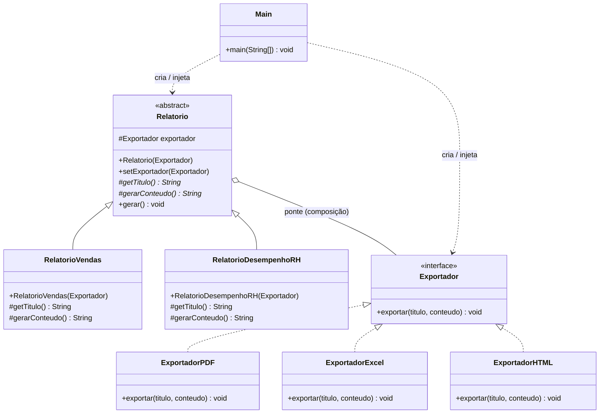
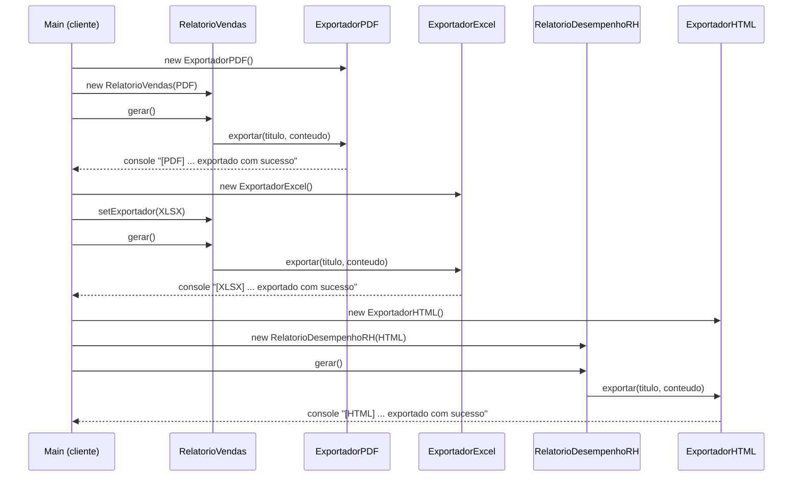

# TechFatec BI — Módulo de Relatórios (Padrão Bridge)

Projeto acadêmico que refatora o módulo de relatórios de um sistema de inteligência de negócios (BI) da TechFatec, aplicando o **Padrão de Projeto Bridge** (GoF, categoria Estrutural) para desacoplar **tipo de relatório** de **formato de exportação**.

## 1. Contexto e problema

O sistema legado só sabia gerar o **Relatório de Vendas** em **PDF**. Os novos requisitos são:

- Adicionar um novo tipo de relatório: **Relatório de Desempenho de RH**.
- Permitir que **todos** os relatórios (atuais e futuros) sejam exportados em **PDF**, **Excel (XLSX)** e **HTML**.
- Evitar a explosão combinatória de subclasses (`RelatorioVendasPDF`, `RelatorioVendasExcel`, `RelatorioVendasHTML`, `RelatorioRHPdf`, ...), que cresceria em `M x N` classes a cada novo relatório ou formato.
- Respeitar o **Princípio Aberto/Fechado (OCP)**: adicionar um relatório ou formato novo não pode exigir alterar código existente.

A solução: separar as duas dimensões — **relatório** (o quê) e **formato de exportação** (como) — em duas hierarquias independentes que se comunicam por **composição**, não por herança. Essa é exatamente a definição do padrão **Bridge**.

## 2. Estrutura de diretórios

```
src/com/github/gihyaa/techfatec/
├── abstracao/                     # Hierarquia "Abstração" do Bridge
│   ├── Relatorio.java              # Abstração base — guarda a referência (ponte) para Exportador
│   ├── RelatorioVendas.java        # Abstração refinada
│   └── RelatorioDesempenhoRH.java  # Abstração refinada
├── implementacao/                 # Hierarquia "Implementador" do Bridge
│   ├── Exportador.java             # Interface do implementador
│   ├── ExportadorPDF.java          # Implementador concreto
│   ├── ExportadorExcel.java        # Implementador concreto
│   └── ExportadorHTML.java         # Implementador concreto
└── cliente/
    └── Main.java                   # Script de validação — monta os objetos e injeta as dependências
```

Essa separação física (`abstracao/`, `implementacao/`, `cliente/`) reflete diretamente os dois lados do Bridge e a camada cliente que os conecta.

## 3. Como o Bridge foi aplicado

| Papel no padrão Bridge | Classe/Interface | Responsabilidade |
|---|---|---|
| **Abstraction** | `Relatorio` (abstrata) | Mantém a referência ao `Exportador` e define o fluxo (`gerar()`) |
| **Refined Abstraction** | `RelatorioVendas`, `RelatorioDesempenhoRH` | Definem o título e o conteúdo específicos de cada relatório |
| **Implementor** | `Exportador` (interface) | Contrato único: `exportar(titulo, conteudo)` |
| **Concrete Implementor** | `ExportadorPDF`, `ExportadorExcel`, `ExportadorHTML` | Formatação específica de cada saída |

A "ponte" é o atributo `protected Exportador exportador` dentro de `Relatorio`: qualquer subclasse de `Relatorio` pode ser combinada com qualquer `Exportador`, em qualquer momento, sem que uma hierarquia conheça a outra.

```java
public abstract class Relatorio {
    protected Exportador exportador;

    protected Relatorio(Exportador exportador) {   // injeção via construtor
        this.exportador = exportador;
    }

    public void setExportador(Exportador exportador) {  // troca em tempo de execução
        this.exportador = exportador;
    }

    protected abstract String getTitulo();
    protected abstract String gerarConteudo();

    public void gerar() {
        exportador.exportar(getTitulo(), gerarConteudo());
    }
}
```

### Injeção de dependência

Nenhuma classe de relatório instancia um exportador concreto com `new`. O `Exportador` é sempre **injetado via construtor** (`RelatorioVendas(Exportador exportador)`, `RelatorioDesempenhoRH(Exportador exportador)`) e pode ser **trocado em tempo de execução** com `setExportador(...)`. Quem decide qual `Exportador` usar é a camada cliente (`Main`), nunca a classe de relatório — as duas hierarquias ficam totalmente desacopladas.

### Aderência ao OCP

- Para adicionar um **novo formato** (ex.: CSV): basta criar `ExportadorCSV implements Exportador`. Nenhuma classe de `abstracao/` é tocada.
- Para adicionar um **novo relatório** (ex.: Relatório Financeiro): basta criar `RelatorioFinanceiro extends Relatorio`. Nenhuma classe de `implementacao/` é tocada.
- Resultado: **2 relatórios + 3 formatos = 5 classes**, não as 6 subclasses que a abordagem ingênua (`M x N`) exigiria — e a vantagem cresce a cada novo item.

## 4. Diagrama de classes



## 5. Diagrama de sequência (script de validação)



## 6. Script de validação (`cliente/Main.java`)

O `Main` simula, em sequência, as três rotinas exigidas:

1. Gera o **Relatório de Vendas em PDF** (injeção via construtor).
2. Troca o exportador do **mesmo objeto**, em tempo de execução, para **Excel** (`setExportador`).
3. Gera o **Relatório de RH em HTML**, provando que o novo tipo de relatório funciona com qualquer formato sem alterar `implementacao/`.

## 7. Como executar

Pré-requisitos: JDK 17+ e Maven.

```bash
git clone https://github.com/Gihyaa/TechFatec.git
cd TechFatec
mvn compile exec:java
```

Alternativa sem Maven:

```bash
mkdir -p bin
find src -name "*.java" > sources.txt
javac -encoding UTF-8 -d bin @sources.txt
java -cp bin com.github.gihyaa.techfatec.cliente.Main
```

## 8. Saída esperada no console

```
######################################################################
  TechFatec BI - Validacao do desacoplamento (Padrao Bridge)
######################################################################

>> Etapa 1 | Relatorio de Vendas exportado em PDF
----------------------------------------------------------------------
[PDF] Gerando documento PDF: Relatorio de Vendas
[PDF] Conteudo: Total de vendas: R$ 150.000,00 | Produtos vendidos: 1.200 | Ticket medio: R$ 125,00
[PDF] Arquivo Relatorio_de_Vendas.pdf exportado com sucesso.

>> Etapa 2 | Mesmo Relatorio de Vendas trocado para XLSX em tempo de execucao
----------------------------------------------------------------------
[XLSX] Criando planilha: Relatorio de Vendas
[XLSX] Celulas: Total de vendas: R$ 150.000,00 | Produtos vendidos: 1.200 | Ticket medio: R$ 125,00
[XLSX] Arquivo Relatorio_de_Vendas.xlsx exportado com sucesso.

>> Etapa 3 | Relatorio de Desempenho de RH exportado em HTML
----------------------------------------------------------------------
[HTML] <html><head><title>Relatorio de Desempenho de RH</title></head>
[HTML] <body><h1>Relatorio de Desempenho de RH</h1><p>Colaboradores avaliados: 85 | Media de desempenho: 8,4 | Turnover: 3,2%</p></body></html>
[HTML] Arquivo Relatorio_de_Desempenho_de_RH.html exportado com sucesso.

Validacao concluida: 3 etapas executadas com 3 formatos disponiveis [PDF, XLSX, HTML].
```

*Nota de encoding: se os acentos não aparecerem corretamente no terminal, rode com `LANG=C.utf8` antes do comando — isso é apenas configuração de locale do terminal, o código-fonte já está em UTF-8.*

## 9. Tecnologias

- Java 17
- Maven (`maven-compiler-plugin`, `maven-jar-plugin`, `exec-maven-plugin`)

## 10. Autoria

Projeto acadêmico desenvolvido para a disciplina de Engenharia de Software / Padrões de Projeto — TechFatec.
